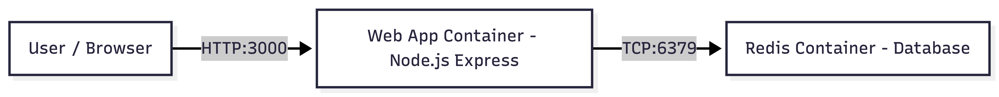

# Course_Project

## Vision
This project demonstrates a two-component containerized application using Infrastructure as Code principles.

### Architecture

### Components

Component 1: Web Application (Node.js)
- Handles HTTP requests from users.
- Displays the current visitor count.
- Increments the visitor count on each request.

Component 2: Redis
- Stores the visitor counter.
- Updates the count when requested by the web application.
- Communicates with the web application using TCP.

### Communication Flow

Browser -> HTTP -> Web App
Web App -> TCP (Redis protocol) -> Redis
Redis -> Web Application -> Browser

## Proposal

This project will use lightweight container images for deployment.

- Web Application Base Image: `node:18-alpine`
- Redis Base Image: `redis:7-alpine`

The final deployment will be demonstrated on CloudLab using containerization.

## Build Process

I created a Dockerfile inside the app folder to containerize my Node.js application.
Here is what each line does:

- FROM node:18-alpine
    I chose this base image because it is a smaller version of Node.js, which makes the container lighter and faster to run.

- WORKDIR /app
    This sets the working directory inside the container so all commands run in the app folder.

- COPY package*.json ./
    This copies the package files first so Docker can cache the dependencies and not reinstall them every time.

- RUN npm install
    This installs all the dependencies needed for the app like express and redis.

- COPY . .
  This copies the rest of the application code into the container.

- EXPOSE 3000
  This tells Docker that the app will run on port 3000.

- CMD ["node", "app.js"]
    This starts the Node.js application when the container runs.
I used docker-compose to build and run both the web container and the Redis container together.

## Networking

The containers communicate using Docker's default bridge network.
When I run docker-compose, Docker automatically puts both containers on the same network and assigns them IP addresses.
Instead of using IP addresses directly, I used the name "redis" in my code to connect to the Redis container. Docker automatically translates this name to the correct IP address.
This makes it easier because I don't have to worry about IPs changing.

The communcation works like this:
1. The browser sends a request to the web container
2. The web container connects to Redis using TCP on port 6379
3. Redis updates the visitor count and sends it back.

This setup allows the containers to talk to each other internally without exposing Redis to the outside.

### System Overview

This project implements a cloud-native two-tier application using Docker containers.
The system consists of a Node.js wrb server and a Redis database that work together to maintain a visitor count.
When a user accesses the application, the web server increments a counter stored in Redis and displays the updated value.

### System Design

The architecture follows a simplle client-server model:
- Client sends HTTP request to the Node.js container
- Node.js container communicates with Redis container
- Redis stores the visitor count

This separation of services demonstrates a real-world microservice pattern.

### Deployment Process

The system is deployed using Docker Compose.

Steps:
1. Build the Node.js container using the Dockerfile
2. Pull the Redis image from Docker Hub
3. Start both containers using:
   docker compose up --build

Docker Compose automatically creates a network and connects the services.

### Key Features

- Multi-container architecture
- Custom Dockerfile for Node.js application
- Redis integration for persistent counting
- Container networking using service names
- Graceful handling of Redis connection issues

### Challenges and Solutions 

**Challenge:** Redis may not be ready when the web server starts
**Solution:** Used Docker Compose networking and service name resolution

### Future Improvements

- Add a fronted UI
- Implement authentication
- Deploy using CI/CD pipeline
- Add container security features (non-root user, resource limits)
